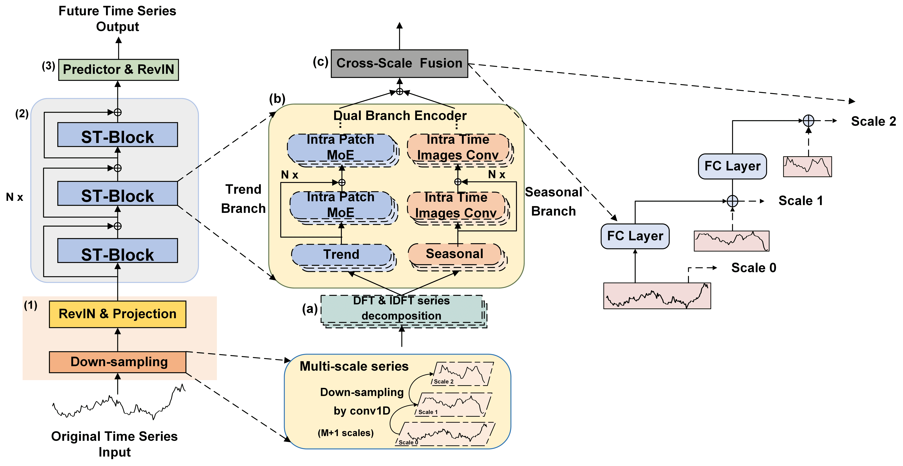
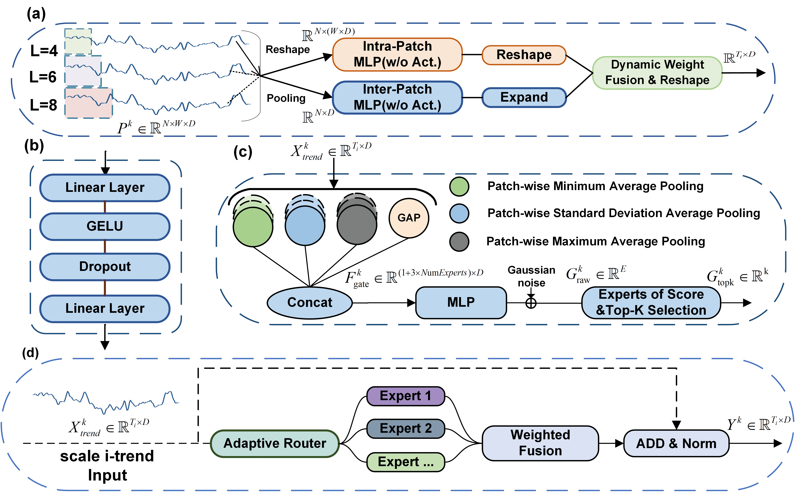
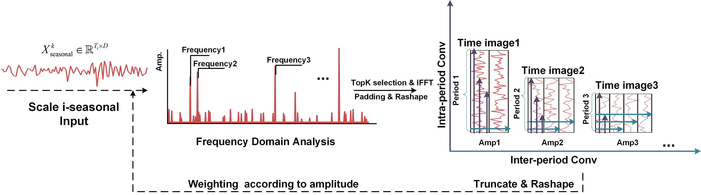
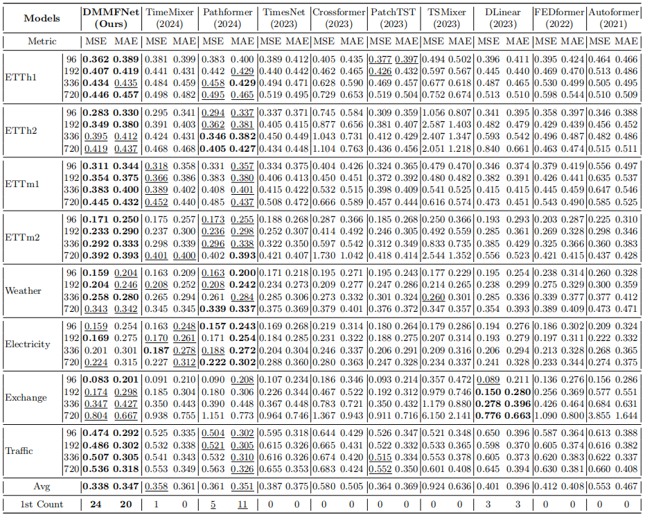

<div align="center">
  <h2><b> ST-Net: Dual-Branch Encoding with Seasonal-Trend Decomposition for Time Series Forecasting </b></h2>
</div>
<div align="center">
</div>

## 1. Model Overview

We introduce ST-Net, a two-part system that separates seasonal and trend components using two specialized encoders: a CNN (Intra Time Image Convolutional) for capturing non-linear seasonal patterns and an MLP (Intra-Patch Mixture-of-Experts) for identifying linear trends.

### 1.1 Architecture

Dual-branch architecture consists of an MLP-based trend stream and a CNN-based seasonal stream.

<p align="center">

</p>

### IPM 
The IPM module adopts a hybrid expert architecture based on multi-granularity patch division. Each PatchExpert processes a single granularity patch, integrating both intra-patch and inter-patch trend information. Through multi-expert fusion, it accurately models trend features.
<p align="center">

</p>

### ITC 
The ITC module employs multi-cycle analysis to extract the main cyclical components, performs 2D tensor reorganization on the time series, and uses multi-scale lateral and longitudinal decomposition convolutions. It focuses on extracting seasonal information within cycles and between cycles, and finally integrates them for effective seasonal component modeling.
<p align="center">

</p>

## 2. Results

### 2.1 Forecasting with Unified Experimental Settings

In the unified experimental settings, ST-Net achieves the best performance on 75% of the cases using the MSE metric and 62.5% of the cases using the MAE metric.

<p align="center">

</p>

### 2.2 Transfer Learning
Pretraining on source datasets and evaluating through zero-shot prediction and fine-tuning demonstrates excellent generalization and transferability. The partial fine-tuning strategy is a lightweight method
that requires fewer computational resources and reduces the number of parameters by 70.1%. Despite this, it achieves prediction accuracy nearly as high as PatchTST full-tuning, showing that ST-Net’s dual-branch architecture effectively captures transferable seasonal-trend patterns.

<p align="center">

</p>

### 2.3 Ablation Study
The results of transfer learning: Effect of Each Module in ST-Net, with Downsampling (shortened to D-s).

<p align="center">

</p>

## 3. Getting Started

1. Install conda environment: ```conda env create -f environment.yml```

2. Download data. You can download the datasets from [Google Driver](https://drive.google.com/u/0/uc?id=1NF7VEefXCmXuWNbnNe858WvQAkJ_7wuP&export=download), [Baidu Driver](https://pan.baidu.com/s/1JAHUxFh9BtYS7m1_3jmU6g?pwd=xcmw). All datasets are pre-processed and can be used easily. Create a seperate folder ```./dataset``` and put all the files in the directory.

3. Train the model. We provide the experiment scripts of all benchmarks under the folder `./scripts`.  You can reproduce the experiments by:

```
bash scripts/STNet_ETTh1.sh
```

All experiments were conducted on NVIDIA RTX 3090 24GB GPUs. You can adjust the hyperparameters based on your needs (e.g. batch size, patch length, lookback windows and prediction lengths, num of ST-blocks).
## Acknowledgement

We appreciate the following github repos for their valuable code and effort:
- Time-Series-Library (https://github.com/thuml/Time-Series-Library)
- Autoformer (https://github.com/thuml/Autoformer)
- TimeMixer (https://github.com/kwuking/TimeMixer)
- PatchTST (https://github.com/yuqinie98/PatchTST)
- DLinear (https://github.com/cure-lab/LTSF-Linear)
- RevIN (https://github.com/ts-kim/RevIN)
- FEDformer (https://github.com/MAZiqing/FEDformer)


