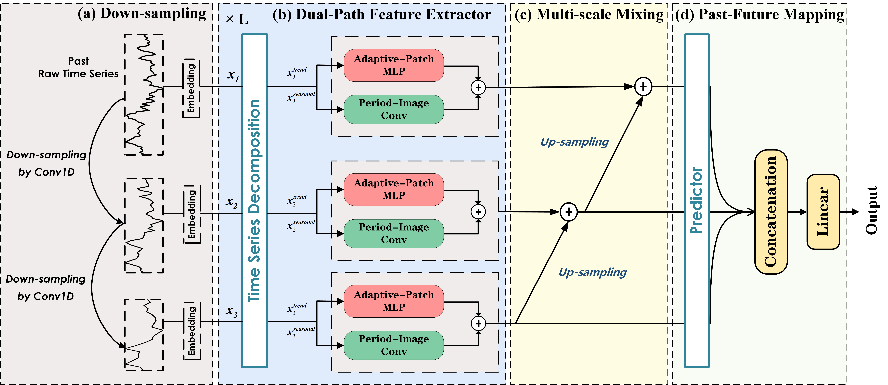
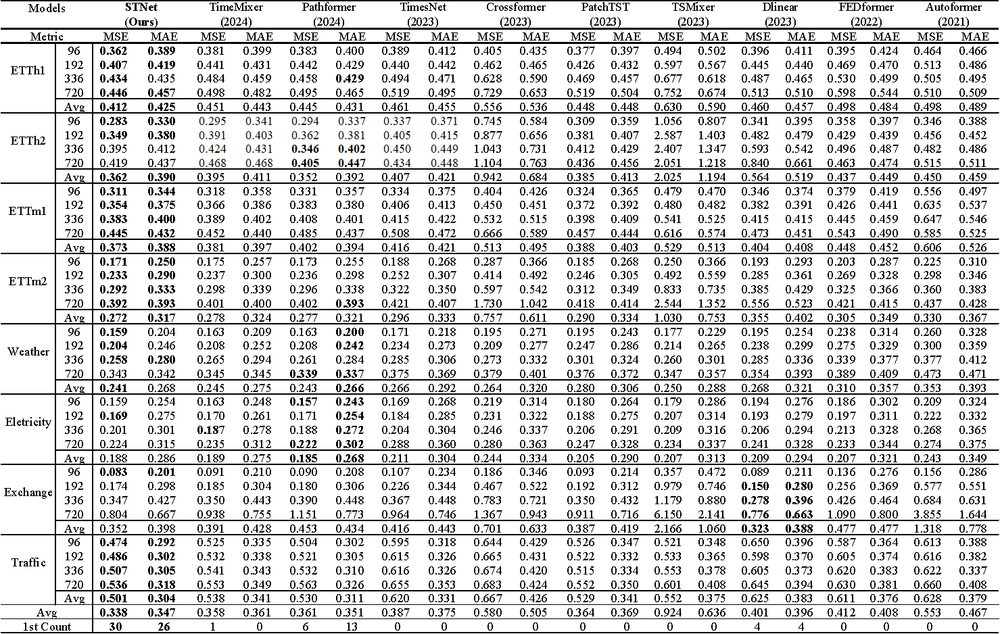

<div align="center">
  <h2><b> (ICIC2025 Oral)ST-Net: Dual-Path Encoding with Seasonal-Trend Decomposition for Long-Term Time Series Forecasting </b></h2>
</div>
<div align="center">
</div>

### This is an offical implementation of "ST-Net: Dual-Path Encoding with Seasonal-Trend Decomposition for Long-Term Time Series Forecasting" 

## 1. Overall Architecture

<p align="center">

</p>

## 2. Results

In the unified experimental settings, ST-Net achieves the best performance on 75% of the cases using the MSE metric and 62.5% of the cases using the MAE metric.

<p align="center">

</p>


## 3. Getting Started

1. Install conda environment: ```conda env create -f environment.yml```

2. Download data. You can download the datasets from [Google Driver](https://drive.google.com/u/0/uc?id=1NF7VEefXCmXuWNbnNe858WvQAkJ_7wuP&export=download), [Baidu Driver](https://pan.baidu.com/s/1JAHUxFh9BtYS7m1_3jmU6g?pwd=xcmw). All datasets are pre-processed and can be used easily. Create a seperate folder ```./dataset``` and put all the files in the directory.

3. Train the model. We provide the experiment scripts of all benchmarks under the folder `./scripts`.  You can reproduce the experiments by:

```
bash scripts/STNet_ETTh1.sh
```

All experiments were conducted on NVIDIA RTX 3090 24GB GPUs. You can adjust the hyperparameters based on your needs (e.g. batch size, patch sizes, lookback windows and prediction lengths, num of ST-blocks).
## Acknowledgement

We appreciate the following github repos for their valuable code and effort:
- Time-Series-Library (https://github.com/thuml/Time-Series-Library)
- Autoformer (https://github.com/thuml/Autoformer)
- TimeMixer (https://github.com/kwuking/TimeMixer)
- PatchTST (https://github.com/yuqinie98/PatchTST)
- DLinear (https://github.com/cure-lab/LTSF-Linear)
- RevIN (https://github.com/ts-kim/RevIN)
- FEDformer (https://github.com/MAZiqing/FEDformer)


